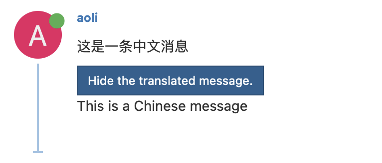

# Fork this repo


# Install Dependencies

You need to install `flask` and `pytest` to run this application.

```
pip3 install flask
pip3 install pytest
```

# Deploy this service to Google cloud

Please follow [this](https://cmu-313.github.io/recitations/reci6-deployment/#task-1b-deploy-on-google-cloud-platform)
tutorial to deploy translator service to Google cloud.


> [!WARNING]
> Set the Entrypoint to empty in the `Set up with Cloud Build` section.


# Test your deployment

Once you have deployed this service, you can access the following link `https://PATH_TO_YOUR_DEPLOYED_SERVICE/?content=这是一条中文消息` and you will see a JSON response

```json
{
    "is_english":false,
    "translated_content":"This is a Chinese message"
}
```

# Integrate Translator Service With NodeBB

Please merge the changes in `https://github.com/CMU-313/NodeBB-S24/tree/leo/draft-pr` to your NodeBB repository.

```
git remote add upstream https://github.com/CMU-313/NodeBB-S24.git
git fetch upstream
git cherry-pick f385a392cfe26812a86b2c87729d561e5c3c9cd4
```

After you merge the changes, you need to build NodeBB with new changes.

```
./nodebb build
```

The changes will call translator API when a new post
is received. If the API response indicates that the post is not in English, it will show the translated content in the post.

Since you need to use your own translator service, you need to provide your API endpoint through environment
variable `TRANSLATOR_API`.

```
export TRANSLATOR_API=https://PATH_TO_YOUR_DEPLOYED_SERVICE
./nodebb start
```

To add environment variables to your GCP deployment, you can follow [this](https://cloud.google.com/run/docs/configuring/environment-variables) tutorial.


Once you have deployed the changes, you can test the translator service by creating a new post in NodeBB with non-English content `这是一条中文消息`.




# Implement LLM based translator

Please replace `translate` method in `src/translator.py` with your LLM based
implementation. The `translate` method takes a string `content` as input and
returns a tuple `(bool, str)`. Indicating if `content` is in English and
the translated content if `content` is not in English.

> [!WARNING]
> Do not push your API key to your repository. You should use environment variables to store your API key.

## Handle responses from LLM

You need to design your prompt so that you can parse the result from a LLM model.
However, your system needs to be robust if LLM does not respond as you expect.
It is up to you how your system reacts to unexpected responses. You can try a different prompt, return an error message, or simply assume the input is in English.

# Test your implementation

Now you need to test your implementation.

To do this, please complete the unit test in `test/unit/test_translator.py`.
In `test_llm_normal_response()`, please implement a unit test that verifies that
your program can return correct value if LLM provides an expected result.
In `test_llm_gibberish_response()`, please implement a unit test that verifies
that your program can handle a gibberish response.

## Manual CI Documentation

In order to test mock tests, run `pytest test/unit/test_translator.py`